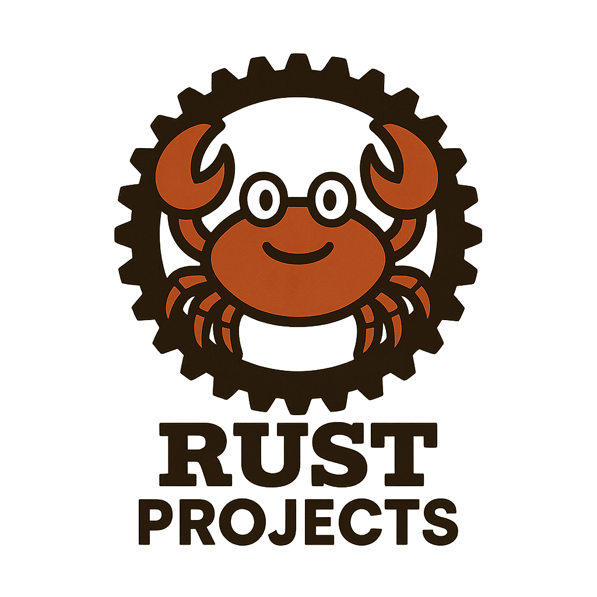

[![Contributors][contributors-shield]][contributors-url]
[![Forks][forks-shield]][forks-url]
[![Stargazers][stars-shield]][stars-url]
[![Issues][issues-shield]][issues-url]

<!-- PROJECT LOGO -->
 

  

<h3 align="center">Rust-Projects!</h3>
  

    These are some projects from various offensive development trainings that I have rewritten from C to Rust.
  

### Built With
[![Rust][Rust]][rust-url]
 
![Windows]

### WinAPI
This simply allocates and frees memory as well as pop up a window to the user saying "Hack The Planet".

### create_remote_thread
This performs a simple process injection by using VirtualAllocEx, WriteProcessMemory, and CreateRemoteThread.

### text_loader
This performs a simple process injection with shellcode in the text section by using VirtualAlloc, copy, VirtualProtect, and CreateThread.

(<a href="#readme-top">back to top</a>)

<!-- MARKDOWN LINKS & IMAGES -->
<!-- https://www.markdownguide.org/basic-syntax/#reference-style-links -->
[contributors-shield]: https://img.shields.io/github/contributors/inev89/rust-projects.svg?style=for-the-badge
[contributors-url]: https://github.com/inev89/rust-projects/graphs/contributors
[forks-shield]: https://img.shields.io/github/forks/inev89/rust-projects.svg?style=for-the-badge
[forks-url]: https://github.com/inev89/rust-projects/network/members
[stars-shield]: https://img.shields.io/github/stars/inev89/rust-projects.svg?style=for-the-badge
[stars-url]: https://github.com/inev89/rust-projects/stargazers
[issues-shield]: https://img.shields.io/github/issues/inev89/rust-projects.svg?style=for-the-badge
[issues-url]: https://github.com/inev89/rust-projects/issues
[rust]: https://shields.io/badge/-Rust-3776AB?style=flat&logo=rust
[rust-url]: https://rust-lang.org
[Windows]: https://img.shields.io/badge/Windows-3776AB?style=flat&logo=windows